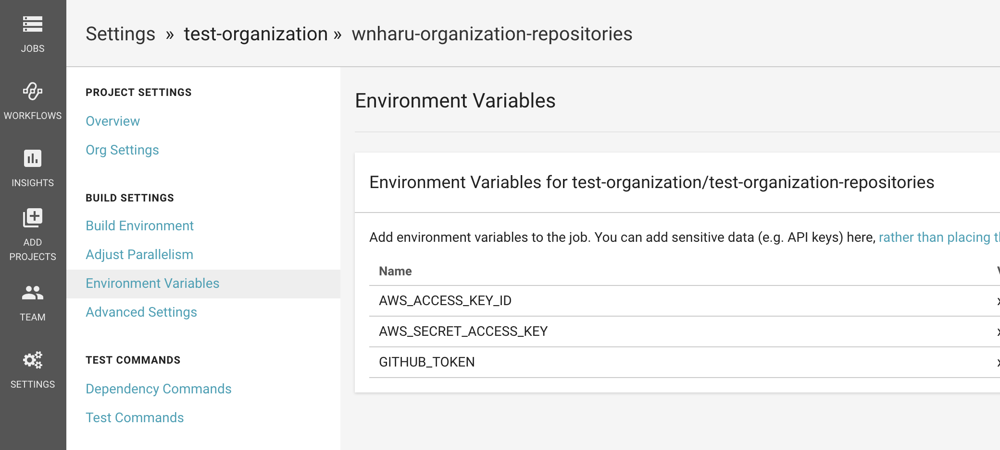

<!--more-->

## リポジトリを作る
Githubに`test-organization-repositories`というリポジトリを作る前提で進めていきます。
`test-organization`は適宜修正してください。`-repositories`も好きな名前でも構いません。

## backendを作成する
今回はAWS S3で進めますが、[Google Cloud Storage や Azure Resource Manager](https://www.terraform.io/docs/backends/types/index.html)でも実装できます。
S3に`test-organization-repositories`を作成しました。

## CI用のAIMを発行する
S3とIAMの権限を付与し、アクセスキー、シークレットキーを追加します

## GithubのPersonal access tokensを発行する
[https://github.com/settings/tokens](https://github.com/settings/tokens)からPersonal access tokensを発行します。
`notifications`などは不要ですが、念のため全てにチェックをいれます。
実運用の場合はOrganizationのBotのような絶対に抜けない人を入れると良いでしょう

## 動作確認する
`main.tf`を作成します。
```main.tf
terraform {
  backend "s3" {
    bucket = "test-organization-repositories"
    key    = "terraform.tfstate"
    region = "ap-northeast-1"
  }
}

provider "github" {
  organization = "test-organization"
}
```

```
$ AWS_ACCESS_KEY_ID=コピーしたアクセスキー AWS_SECRET_ACCESS_KEY=コピーしたシークレットキー GITHUB_TOKEN=コピーしたトークン terraform init
```
を実行して確認してみましょう

## Circle CIでterraformを実行する

`.circleci/config.yml`を作成します。
```
version: 2

references:
  terraform-image: &terraform-image
    docker:
      - image: hashicorp/terraform:0.11.10 

jobs:
  terraform-plan:
    <<: *terraform-image
    steps:
      - checkout
      - run: terraform init
      - run: terraform fmt -check || exit 1
      - run: terraform plan
  terraform-apply:
    <<: *terraform-image
    steps:
      - checkout
      - run: terraform init
      - run: terraform apply -auto-approve

workflows:
  version: 2
  build-deploy:
    jobs:
      - terraform-plan:
          filters:
            branches:
              ignore: master
      - terraform-apply:
          filters:
            branches:
              only: master  
```
また、
https://circleci.com/gh/test-organization/test-organization-repositories/edit#env-vars
にAWS_ACCESS_KEY_IDとAWS_SECRET_ACCESS_KEYとGITHUB_TOKENを保存します。
(test-organizationは自分のorganizationに変更してアクセスしてください。)


## 作成したレポジトリをテストが通らないといけないようにする
↑の`.circleci/config.yml`はmasterでないときは、fmtとplanを確認し、fmtがただしいか、planでエラーが出ないかをチェックしています。
テストが通らなかったときはマージできないようにしましょう!

repositories.tf
```
data "github_repository" "repo" {
  name = "test-organization-repositories"
}

resource "github_branch_protection" "branch_protection" {
  repository     = "${data.github_repository.repo.name}"
  branch         = "master"
  enforce_admins = false

  required_status_checks {
    strict   = false
    contexts = ["ci/circleci: terraform-plan"]
  }
}
```

## リポジトリを作りたいとき
`test-repo`というのを作りたいと思います。
ブランチを切ってPull Requestを作り、マージしてみましょう。
```
resource "github_repository" "repo" {
  name         = "test-repo"
  description  = ""
  homepage_url = ""
  has_issues   = true
  private      = false
}
```
その他の細かい設定は[こちら](https://www.terraform.io/docs/providers/github/r/repository.html)で確認できます。
